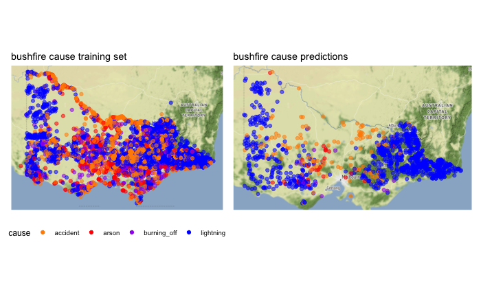

```{r setup, include=FALSE}
knitr::opts_chunk$set(echo=FALSE, warning=FALSE, message=FALSE, fig.align="center")
library(tidyverse)
library(patchwork)
library(ggmap)
```

# ETC5521: Summary of Kaggle challenge {-}

## Data pre-processing {-}
```{r readin, include=FALSE}
# read in training data
fires_tr_full <- read_csv("data/student_training_release.csv") %>% 
  mutate(cause = factor(cause,
                        levels = c("lightning", "accident", "arson", "burning_off")))

fires_tr_full <- fires_tr_full %>% 
  filter(month %in% c(1:3, 10:12))
```


From this Kaggle challenge, I really learnt the importance of data pre-processing and feature selection and how vital a role it plays to develop and refine the model. In fact, most time was devoted to this section. The training set provided was bushfire data over the course of 20 years from 2000 to 2019 while the test set to predict the 2019-2020 Australia bushfire season. Data pre-processing steps involves dealing with missingness in the data and processing training data to coincide with test data to make better predictions.

First, `month` of in the training set were filtered to January to March and October to December to match the test set. Furthermore, missing data were omitted. Majority of missingness in the training set comes from wind(`ws`) data. Plotting the missing data on a map (as per Figure below); no structure(such as inaccessibility) was identified hence missingness in windspeed data was deduced to occur at random and removed accordingly.

```{r wsmissing, fig.cap="missing windspeed data", message=FALSE, echo=TRUE, fig.height=4}
ggmap::qmplot(x = lon,
              y = lat,
              data = filter(fires_tr_full, is.na(ws)),
              geom = "point",
              colour = I("red"),
              alpha = 0.4) +
  scale_alpha(guide = "none") +
  ggtitle("arson")
```

```{r, include=FALSE}
fires_tr_full <- fires_tr_full %>% 
  na.omit() 
```


# Important variables for predictions {-}
```{r}
# --- split training set; into 2/3 training 1/3 test set
set.seed(3000)

split <- rsample::initial_split(fires_tr_full,
                                prop = 3/4,
                                strata = "cause") # ensure; cause; same proportion in training & test set

fires_tr <- rsample::training(split) # extract training set
fires_ts <- rsample::testing(split) # extract test set
```

This section ties with **feature selection and engineering**, the goal of was to find variables that contain the most (predictive) information. That is, variables with the most variation to distinct between the classes(`causes`). There were essentially 3 types of variables in the data set- spatiotemporal variables(year, month, distances from camp etc.), climate (numerical) variables and forest types (categorical) variables. Then it comes down to being able to evaluate variables using plots or numerical evaluation. 

For **spatio-temporal variables**, maps were plotted against each category and level. For example, to decide on `month`, bushfire occurences was plotted on a map, faceted by `cause` in the column, `month` in rows. It was included in the model considering how January and February had high rate of fires caused by lightning while accidents and arson were more prone in March. `year` was omitted since 2019-2020 bushfire season was unprecedented over the length of training set. 

```{r spatio-map, fig.cap="maps to facilitate spatio-temporal feature selection", fig.height=4, fig.width=6}
fires_map_data <- fires_tr %>% 
  select(cause, month, lat, lon) %>% 
  # find total bushfires by cause & month
  group_by(cause, month) %>% 
  mutate(total_bushfire = n()) %>%
  # find total bushfires by month
  ungroup() %>% 
  group_by(month) %>% 
  mutate(month_total_bushfire = n()) %>% 
  # 100 * total bushfires / total bushfires by month = % of bushfire caused
  mutate(percent = round(total_bushfire/month_total_bushfire * 100), 2) %>% 
  mutate(total_bushfire_percent = paste0(total_bushfire, " (", percent, "%)")) %>% 
  select(cause, month, total_bushfire, percent, total_bushfire_percent, lat, lon)

fires_map_data %>% 
  ggplot() +
  geom_point(aes(x = lon,
                 y = lat,
                 colour = cause),
             alpha = 0.3) +
  geom_sf(data = filter(ozmaps::ozmap_states, NAME == "Victoria"),
          alpha = 0) +
  geom_text(aes(x = 147,
                y = -35,
                label = total_bushfire_percent)) +
  facet_grid(month ~ cause) +
  ggthemes::theme_map() +
  theme(legend.position = "right") +
  scale_colour_manual(breaks = c("accident", "arson", "burning_off", "lightning"),
                    values = c("dark orange", "red", "purple", "blue"))
```


With the **numerical(mostly climate) variables**, most of the variables were repeated but recorded over a different time horizon - for example, `amaxt7` and `amaxt360` denotes average maximum temperature in the past 7 and 360 days respectively. To facilitate choosing these features, a few functions were written to plot a boxplot and a density plot to compare distributions of each variable across the 4 `causes`. Further, a single (quick and dirty) number evaluation that computes the differences in mean values was used in case of close calls. (see code below). The objective was to identify variables with the biggest variation in distribution hence most (predictive) information over the 4 `causes`. Also, skewed distributions can easily be identified in this manner, these are all the distance variables (`dist_cfa`, `dist_road`, `dist_camp`). These were overcomed with a log transformation. Examples of boxplot & density plot shown below.

```{r boxdens, echo=TRUE}
# --- plot boxplot function
plot_boxplot <- function(data, predictor){
  # convert string to variable
  predictor <- sym(predictor)
  
  # unquote variable using {{}}
  data %>%
  ggplot(aes(x = {{predictor}},
             y = cause,
             colour = cause)) +
  geom_jitter(alpha = 0.2) +
  geom_boxplot(alpha = 0,
               colour = "black") +
  scale_colour_manual(breaks = c("accident", "arson", "burning_off", "lightning"),
                    values = c("dark orange", "red", "purple", "blue")) 
}

plot_density <- function(data, predictor){
  # convert string to variable
  predictor <- sym(predictor)
  
  data %>%
  ggplot() +
  geom_density(aes(x = {{predictor}},
                   y = ..density..,
                   colour = cause),
               alpha = 0.2) +
  scale_colour_manual(breaks = c("accident", "arson", "burning_off", "lightning"),
                    values = c("dark orange", "red", "purple", "blue")) +
  theme_bw()
}

# single number evaluation metric (difference between means) *used manually 
single_no_eval <- function(data, predictor){
  
  predictor <- sym(predictor)
  
  data_explore %>% 
    group_by(cause) %>% 
    summarise(mean = mean({{predictor}})) %>% 
    mutate(diff_mean = abs(mean - lag(mean))) %>% 
    summarise(total_diff = sum(diff_mean, na.rm = T))
}
```
```{r box, fig.cap="boxplot and density plot to facilitate numerical feature selection", echo=TRUE, fig.height=3, fig.width=9}
p1 <- plot_boxplot(fires_tr, "dist_cfa") + 
  scale_x_log10() +
  xlab("logged dist_cfa")

p2 <- plot_density(fires_tr, "dist_cfa") +
  scale_x_log10() +
  xlab("logged dist_cfa")

# patchwork
p1 + p2
```

For **categorical variables**, a heatmap was plotted for each variable (example code for `FOR_TYPE` forest type shown below). Most of the bushfires occurs in the same categories across the variables. Hence were deemed not to provide much predictive information and omitted from the model.

```{r heatmap, echo=TRUE, fig.cap="heatmap to facilitate categorical feature selection", fig.height=3}
fires_tr %>% 
  group_by(cause, HEIGHT) %>% 
  mutate(HEIGHT_count = n(),
         .before = FIRE_START) %>% 
  group_by(cause) %>% 
  mutate(total_cause_count = n(),
         .after = HEIGHT_count) %>% 
  mutate(prop = HEIGHT_count/total_cause_count,
         .after = total_cause_count) %>% 
  distinct(cause, HEIGHT, .keep_all = T) %>% 
  ggplot(aes(x = cause,
             y = factor(HEIGHT),
             fill = prop)) +
  geom_bin2d() +
  geom_text(aes(label = round(prop, 2))) +
  scale_fill_continuous(type = "viridis")
```

Having said these, domain knowledge can prove advantageous to narrow down important variables and confirm knowledge with data. 

# Model performance {-}

Model performance was primarily dictated by the previous two steps and the most mechanical step among all, besides selecting the model. Random forest model was chosen. Because is appropriate to handle a multi-class classification problem as it that averages predictions over an ensemble of deep independent trees. Other considerations was also time constraint and limited domain knowledge. Random forest is robust to outliers and no assumptions is required of the underlying distributions of the data.

Furthermore, random forest can be used for feature selection after each run with out of variable importance calculations with out of bag errors. Care is taken to check results against plots in previous steps. 

Then it is a matter of fitting (& tuning) a model, assessing variable importance & understanding the why, then refitting the model to improve predictions. `min_n` and `mtry` hyperparameters were tuned using ten-fold cross validation via `rsample::vfold_cv`, `tune` and `dials` functions. This allows the model to be more robust to different seeds used and generalise predictions better to new(unseen) data. 

```{r map-pred, out.height="80%", out.width="90%", fig.cap="map of training data and model predictions"}

```

Above shows the results from the predictions. Interesting, perhaps not surprising to see most accidents and arsons occur close to the roads. 


